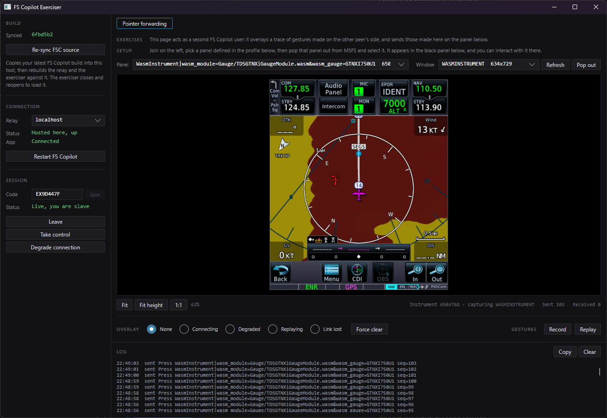

# FS Copilot Exerciser

The other pilot, on this machine... for the most part.

This is a sort of a test bench that replicates a real FSC session over the wire (as opposed
to a local test/dev mode). For the time being, the only feature it exercises is pointer
forwarding/sync.

The left column is shared - join, leave, take/give control, and drop the
link with no goodbye to test session degradation. The right column is for [features](#features).



## Getting started

You need Windows, the .NET 9 SDK, and an FS Copilot checkout.

1. **Build FS Copilot**, Debug, in its own checkout, as you normally would.

2. **Sync it into this repository**

   ```powershell
   .\sync-and-rebuild.ps1
   ```

   This copies the app's build into `fsc/`, builds the relay into `relay/`, builds the
   exerciser against the copy, and records the checkout's path in `fsc-exerciser.json`
   so it doesn't have to ask you again.

3. **Start the exerciser**

   ```powershell
   .\run.cmd
   ```

   It builds first if the exerciser's own source changed, and passes its arguments through.

4. **Press Start FS Copilot**

   Select a relay to use (localhost by default, hosted by the
   execiser), then click "Start FS Copilot". This will launch FSC from the execiser's copy
   and pass it relay and peer ID params, and attempt to auto-join the session.

   To join an app you started yourself, paste its code and press **Join**; both sides have to be on the same relay.

A scripted run can skip the clicking, given an app already up under that code:

```powershell
.\run.cmd --relay localhost --join BNCHA001
```

## Re-syncing the FSC source

When/if your FSC checkout diverges from the exerciser's copy, you'll need to "re-sync" it.

Rebuild FS Copilot as you normally would, then run `sync-and-rebuild.ps1`. This will quit
the exerciser first, along with the FS Copilot and relay it started. Alternatively, you can
click "Re-sync FS Copilot" within the exerciser window itself.

What happens on a re-sync:

- The app is copied, not built: building it is your responsibility. `Community/` is left behind.
- The relay is built.
- The exerciser is rebuilt against the copy.

## What it needs from FS Copilot

The exerciser registers FS Copilot's own packet types, reaching in with reflection.

Depends on the following launch flags:

|                                    |                                                                                                                                                                               |
| ---------------------------------- | ----------------------------------------------------------------------------------------------------------------------------------------------------------------------------- |
| `--relay <host>`                   | Points the app at the selected relay.                                                                                                                                         |
| `--peer-id <id>`                   | Lets this tool name the session code before the app starts, so it can join without anyone copying anything.                                                                   |
| `{t:"watch"}` on the panel channel | Tells a watcher what a panel is told — sync state and role — without being a panel. It is how the tool knows the app is up and what the session is doing. Panels never watch. |

A build without the two flags is still started, you just have to set its relay
yourself and paste the code.

## Features

### Pointer forwarding

Acts as the second pilot for pointer sync. Pick a panel the profile has opted in, pop it out
of the simulator, and the page shows a live capture of that window. Gestures made on the
capture are sent to the app as a peer's would be; gestures the pilot makes in the simulator
arrive and are traced over the capture in another colour.

Around that:

- **Pop out** - click the button then click on a panel to pop it out.
- **Overlay** shows any of the panel's state overlays on demand, without staging the outage
  behind it.
- **Record** writes every gesture, both ways, to an `.ndjson` file beside the exerciser.
  **Replay** sends this window's side of the recording again at its original pace, to
  whichever panel is selected.
- `--panel`, `--window`, `--popout` and `--press x,y` select a panel, select a window, arm
  the pop-out, and send one press at those fractions once the session is live.

#### Limitations

- There is one simulator, so both pilots are looking at the same cockpit. What is exercised is
  the wire and the app's handling of it, not two aircraft staying in agreement.
- Making gestures by hand needs MSFS running with the panel popped out.
- The simulator has no command for pop-out and nothing reports where a panel is on screen, so
  it has to be pointed at once per panel.
- A click is mapped through the simulator's fit-and-centre of the instrument in its pop-out.
  Measured error is within 6.5 instrument pixels, and nothing corrects for it.
- A drag from the pilot is one packet sent at mouse-up, so its trace is drawn after the fact,
  along its recorded timings.
- The capture is `PrintWindow` at about 15 fps, and its cost follows the window's size.
- **Replay** plays the recording made in this run; it does not load a file.

#### What it needs from FS Copilot

|                                                                     |                                                                                                                                                                                              |
| ------------------------------------------------------------------- | -------------------------------------------------------------------------------------------------------------------------------------------------------------------------------------------- |
| `PointerEvent` and `PointerAck`, public                             | The gestures and their acknowledgements, sent and received as any peer's.                                                                                                                    |
| `config` and `panels` to a watcher                                  | The profile's pointer opt-in list, and every helloed panel's key with the rect it measured. It is how this tool knows what there is to press without detecting aircraft or reading profiles. |
| `window.fscPointer.key` in `pointer.js`                             | Finds the panel's document in the simulator's inspector. Titles cannot: two of the same instrument share one.                                                                                |
| `window.fscOverlay(state)` and `window.fscUnlock()` in `pointer.js` | Hold an overlay against the state renewals, and force one off.                                                                                                                               |

The overlays also need the simulator's inspector on port 19999, which does seem to work with DevMode off.
